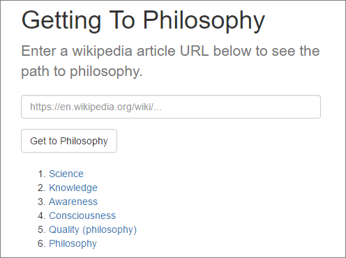

Web app which gives you the path between an article on Wikipedia, and the Philosophy article.

See this [wikipedia article](https://en.wikipedia.org/wiki/Wikipedia:Getting_to_Philosophy) for more information about the idea.



## Running

Install a recent version of Node.js (v4 or greater), and run the following commands:

```
npm install
npm start
```

## Testing

```
npm test
```

## License

MIT
